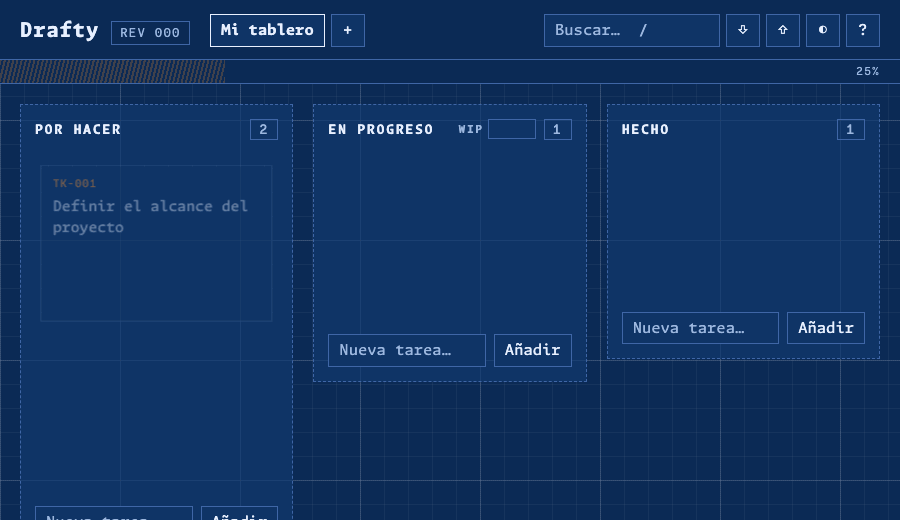
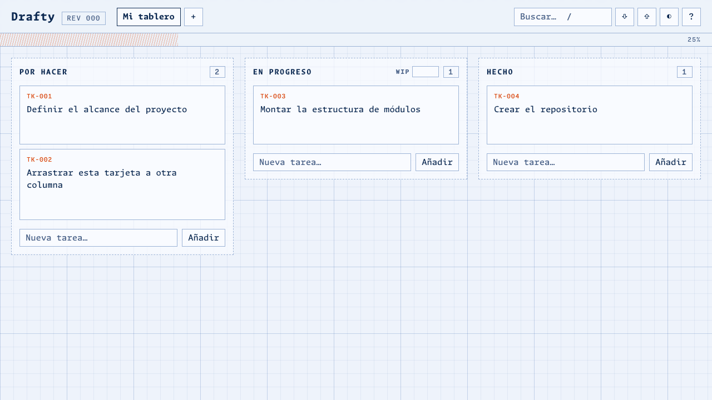
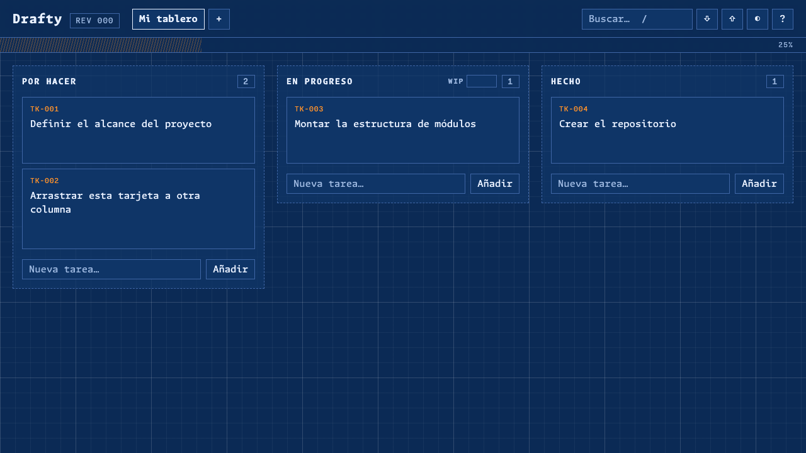
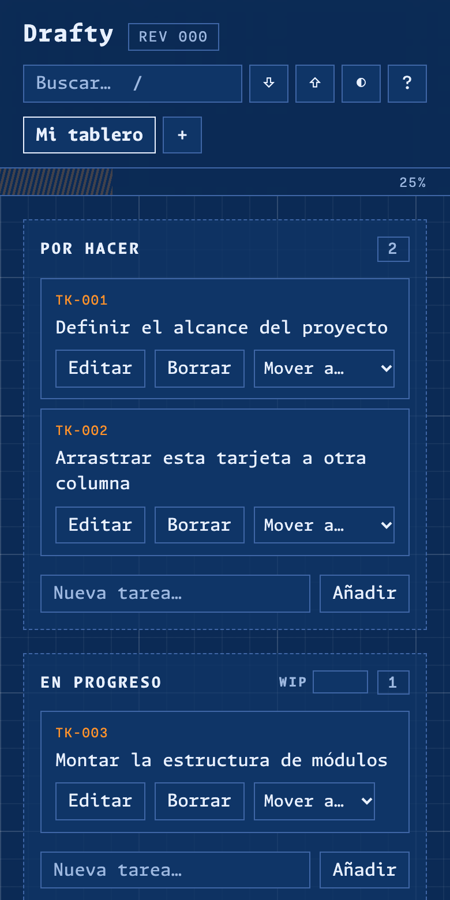

# Drafty

🌐 [English](README.md) · **Español**

[](https://github.com/zSamir015/drafty/actions/workflows/test.yml)
[](LICENSE)

**[Demo en vivo →](https://zsamir015.github.io/drafty/)**

Tablero Kanban con estética de plano técnico (blueprint), arrastre fluido y animaciones con física. Hecho en **JavaScript vanilla**, sin frameworks ni build.



## Qué demuestra este proyecto

- **Interacción compleja sin frameworks**: arrastre propio con pointer events, animaciones FLIP y física de muelles.
- **Arquitectura limpia**: estado inmutable y puro separado del DOM, con un único punto de cambio.
- **Accesibilidad completa**: todo se puede hacer con teclado, con anuncios para lectores de pantalla.
- **Calidad**: 30 tests unitarios, CI en cada push, CSP estricta y modo offline (PWA).

| Claro | Oscuro | Móvil |
|---|---|---|
|  |  |  |

## Características

- **Arrastre propio con pointer events**: funciona con mouse y con el dedo (pulsación larga). La tarjeta se levanta con un spring, se inclina según la velocidad, las demás se reacomodan (FLIP) y al soltar se asienta en su hueco. Autoscroll cerca de los bordes; `Esc` cancela.
- **Animaciones con [Motion](https://motion.dev)**: entrada en cascada, salida con colapso, contadores, toasts y un sello «Hecho» al completar una tarea.
- **Deshacer / rehacer** (`Ctrl+Z` / `Ctrl+Shift+Z`) con historial de 100 pasos, y toast con botón «Deshacer» al borrar.
- **Varios tableros** con pestañas: crear, renombrar (doble clic) y borrar.
- **Tarjetas con prioridad, etiqueta y fecha límite**, con aviso de vencidas.
- **Búsqueda en vivo** por título, etiqueta o código (`TK-007`).
- **Límite WIP** en «En progreso»: la columna se marca al superarlo.
- **Barra de progreso** y cajetín `REV` con el número de cambios.
- **Exportar / importar JSON** con validación completa del archivo.
- **Sincronización entre pestañas** abiertas.
- **Tema claro / oscuro** con transición (View Transitions API).
- **PWA**: instalable y funciona sin conexión.
- **Accesible**: todo se puede hacer con teclado, anuncios `aria-live`, foco conservado y respeto de `prefers-reduced-motion`.

## Atajos de teclado

| Tecla | Acción |
|---|---|
| `N` | Nueva tarea |
| `/` | Buscar |
| `?` | Ayuda |
| `Ctrl` `Z` / `Ctrl` `⇧` `Z` | Deshacer / rehacer |
| `←` `→` `↑` `↓` | Moverse entre tarjetas |
| `Alt` + flechas | Mover la tarjeta enfocada |
| `Enter` / `Supr` | Editar / borrar la tarjeta enfocada |
| `Esc` | Cancelar edición o arrastre |

## Ejecutar

Los ES modules no cargan desde `file://`, así que hace falta un servidor estático:

```bash
npm run dev          # python3 -m http.server 5173
# o: npx serve .
```

Abrir <http://localhost:5173>.

## Tests

```bash
npm test             # node --test, sin dependencias
```

Cubren la lógica pura: estado del tablero, workspace (varios tableros y migración de datos) e historial.

## Arquitectura

La lógica está separada del DOM. Todo cambio pasa por un único punto (`commit`) que guarda el estado anterior en el historial, persiste y redibuja.

```
js/
├── state.js      Estado de un tablero. Funciones puras e inmutables.
├── workspace.js  Varios tableros, límite WIP y migración v1 → v2. Puras.
├── history.js    Deshacer / rehacer. Puras.
├── storage.js    localStorage, sincronización entre pestañas, export / import.
├── render.js     Reconciliación por id: reutiliza nodos y anima solo lo que cambia.
├── motion.js     Único módulo que usa Motion (springs, FLIP, entradas, salidas).
├── dragdrop.js   Arrastre con pointer events; solo emite (id, columna, índice).
├── keyboard.js   Atajos y movimiento con teclado.
├── toast.js      Notificaciones con acción.
├── theme.js      Tema claro / oscuro (theme-init.js lo aplica antes de pintar).
├── tilt.js       Inclinación 3D al pasar el mouse.
└── main.js       Conecta los módulos.
```

Decisiones de diseño:

- **Sin build.** Motion se incluye como bundle UMD versionado en `vendor/` (14.0.0, MIT).
- **Arrastre propio en vez del DnD nativo de HTML5.** El nativo no permite animar la tarjeta arrastrada ni funciona con el dedo.
- **El arrastre, el teclado y «Mover a…» comparten `moveCard`**, así que se comportan igual.
- **El texto del usuario nunca pasa por `innerHTML`**, y los datos importados se validan antes de usarse.

## Licencia

[MIT](LICENSE) © 2026 Samir Lorenzo

## Créditos

- [Motion](https://motion.dev): animaciones (MIT).
- [Monaspace](https://monaspace.githubnext.com): tipografía (SIL OFL 1.1).
- Toasts inspirados en [Sileo](https://github.com/hiaaryan/sileo).
